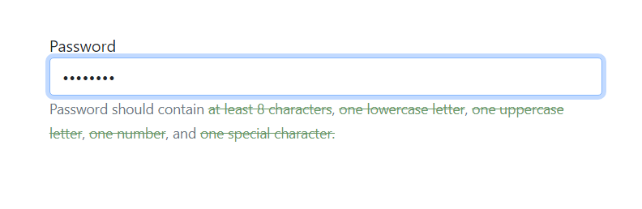
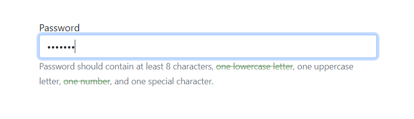

# web602-hw-w5d1

## Description
Validate password with VUE.

The validation is dynamic as the user types password in the textbox, and it has a visual effect of strikethrough by a green line for each fulfilled requirement.

## Tests
Requirements fulfilled should display a strikethrough effect.

### Test 1
Password `John123!` is used the screenshot below.
- has at least 8 characters in total ✔
- has at least 1 digit character ✔
- has at least 1 lowercase character ✔
- has at least 1 uppercase character ✔
- has at least 1 special character ✔

### Test 2
Password `john123` is used the screenshot below.
- has at least 8 characters in total ❌
- has at least 1 digit character ✔
- has at least 1 lowercase character ✔
- has at least 1 uppercase character ❌
- has at least 1 special character ❌

