## Lesson 1: An Introduction, and the ABCs
The first thing to recognize when using regular expressions is that **everything is essentially a character**. Patterns are used to match a specific sequence of characters.

Most patterns use normal ASCII, which includes letters, digits, punctuation and other symbols on your keyboard like %#$@!, but unicode characters can also be used to match any type of international text.

A pattern can be as simple as the common letters on each line, for example "abc" in exercise 1-1, or "123" in exercise 1-2.

The character `\d` can be used in place of any digit from 0 to 9.

The character `\D` can be used in place of any non-digit character.

### Exercise 1-1 Matching Characters
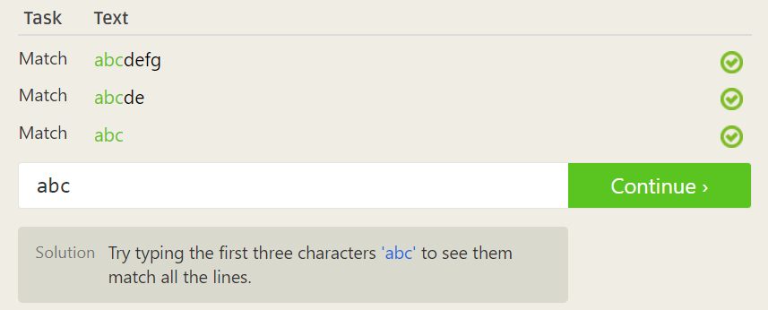

### Exercise 1-2: Matching Digits
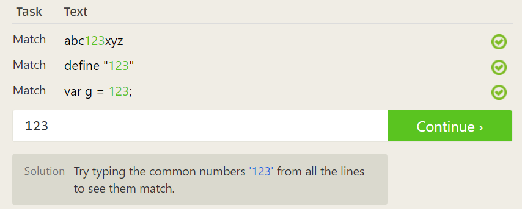

## Lesson 2: The Dot
The character `.` is the metacharacter, a wildcard, which can match any single character (letter, digit, whitespace, everything).

To represent the non-wildcard character "dot", you should use `\.`, an escape character (the backslash `\` followed by the character you want to represent).

### Exercise 2: Matching with Wildcards
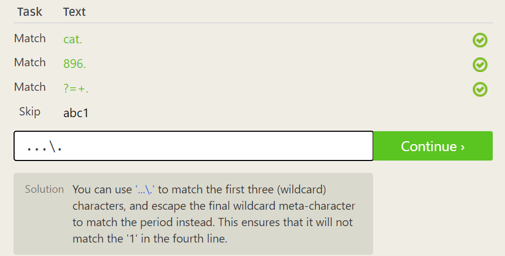

## Lesson 3: Matching Specific Characters
To match one of specific characters, put them in the square brackets `[]`.

For example, the pattern `[abc]` will match a single a, b, or c letter and nothing else.

### Exercise 3: Matching Characters
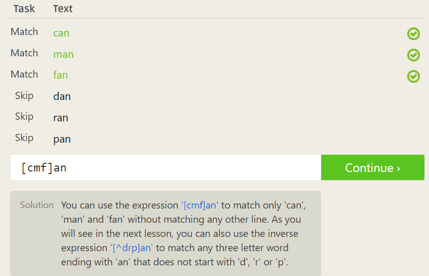

## Lesson 4: Excluding Specific Characters
To exclude one of specific characters, put them preceded by the hat (`^`) in a square brackets.

For example, the pattern `[^abc]` will match any single character except a, b, or c letter and nothing else.

### Exercise 4: Excluding Characters
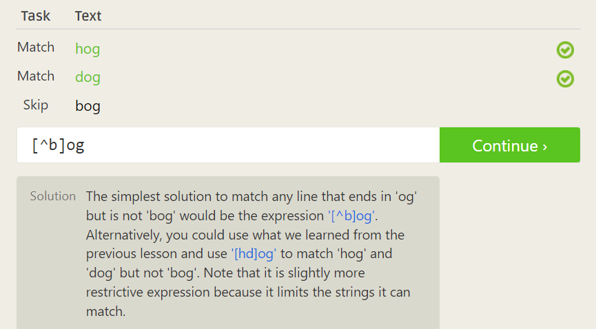

## Lesson 5: Character Ranges
To represent a range of sequential characters, for example, lower-case 'a' to 'z', upper-case 'A' to 'Z', or '0' to '9', use the dash character `-` along with the square bracket `[]`. 

For example, `[0-6]` will match any single digit character from zero (inclusive) to six (inclusive). `[A-C]` will match any single character from 'A' (inclusive) to 'C' (inclusive).

Note that using a range like `[C-A]` does not match a single character from 'C' to 'A'. The range must be specified in ascending order.

You can specify multiple ranges in the same set of brackets. For example, `[A-Za-z0-9]` can represent any single character from 'A' to 'Z', plus from 'a' to 'z', plus from '0' to '9'. The range is equivalent to an alphanumeric character, which can be represented by `\w`.

### Exercise 5: Matching Character Ranges
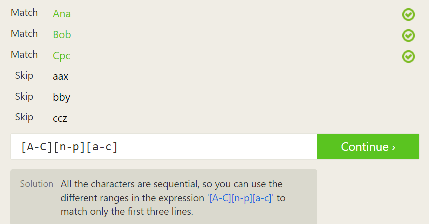

## Lesson 6: Repetition of Characters
Repetition of **a single character** can be rrepresented by the curly braces notation, `{}`, used after the character to be repeated.

For example, `a{3}` means a pattern of 'aaa', and `[a-c]{3}` means a pattern of `[abc][abc][abc]`.

Note that `ab{3}` means a pattern of `abbb`, not repeating pattern "ab" three times. To repeat a group of characters, you should use the parentheses `()`, so `(ab){3}` would match "ababab".

Note that `<char>{<k>}` means matching `<char>` exactly `k` times, not up to `k` times.

Nonetheless, you can use `<char>{<m>, <n>}` to represent a repetition of `m` times (inclusive) to `n` times (inclusive) of the preceding token.

### Exercise 6: Matching Repeated Characters
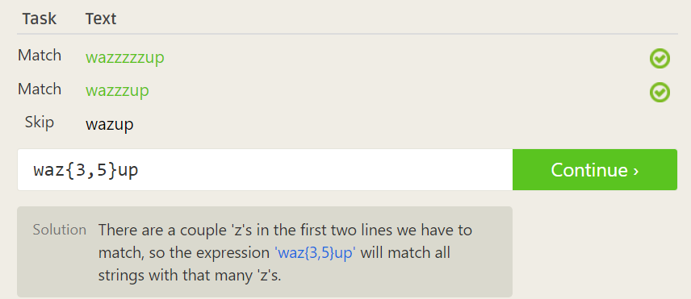

## Lesson 7: Repetition of Characters (Special Case)

A common scenario is to repeat a character at least 1 time. Instead of a restrictive expression like `<char>{2,<an arbitrary large number>}`, there are two special quantifiers:
- `+` to represent 1 or more of the preceding token
- `*` to represent 0 or more of the preceding token

### Exercise 7
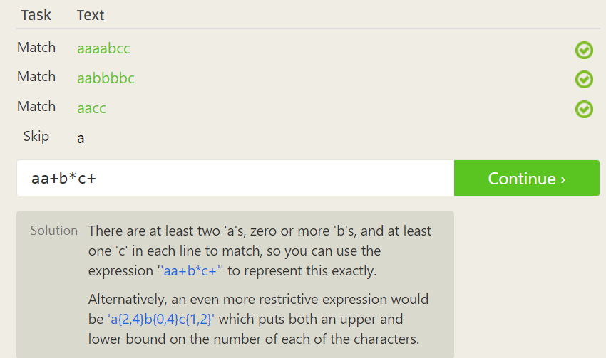

## Lesson 8: Optional Character
Use the question mark `?` to denote that its preceding token is optional.

For example, pattern `ab?c` will match both "abc" and "ac" because `b?` means that 'b' is optional.

### Exercise 8: Matcing Optional Characters
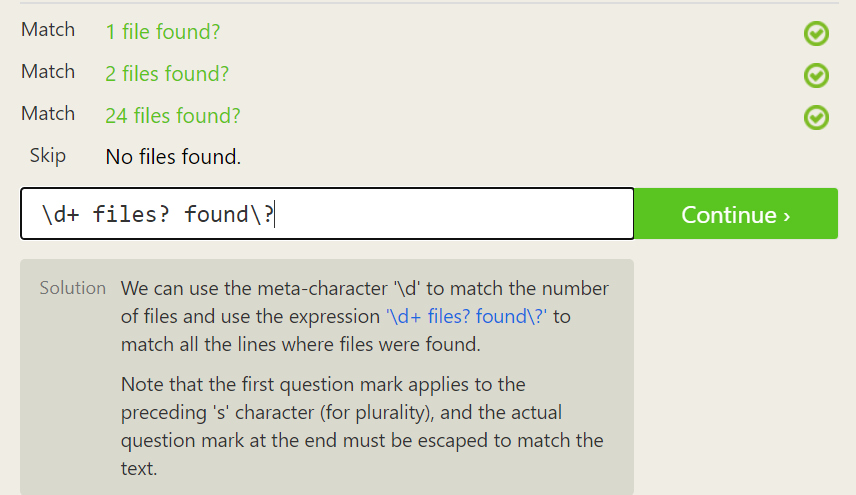

## Lesson 9: Whitespace
Some common forms of whitespace include:
- the space (`..` in Regex)
- the tab (`\t` in Regex)
- the new line (`\n` in Regex)
- the carriage return (`\r` in Regex) in Windows

To match any of the whitespaces above, you can use `\s`.

### Exercise 9:
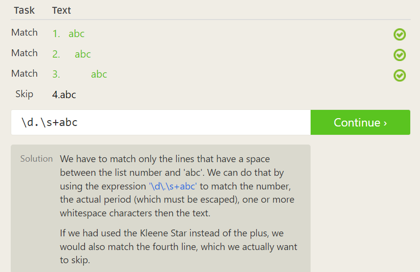

## Lesson 10: Starting with and Ending with
Specifying start-with with the hat `^` and end-with with the dollar sign `$`, so that you can tighten the pattern match.

For example, you might want to find the word `"happy"` in a file, but using `happy` as the pattern will match other words such as `"unhappy"`, which is not desirable. Therefore, you might want to specify a pattern that starts with `"happy"` strictly. To do this, use `^happy`.

By the same virtue, the pattern `low$` will match words such as "low", "below", "allow", but not words like "lower" because the dollar sign `$` specifies that we are looking for words that strictly end-with `low`.

You can use `^` and `$` together to tighten the pattern.

### Exercise 10:
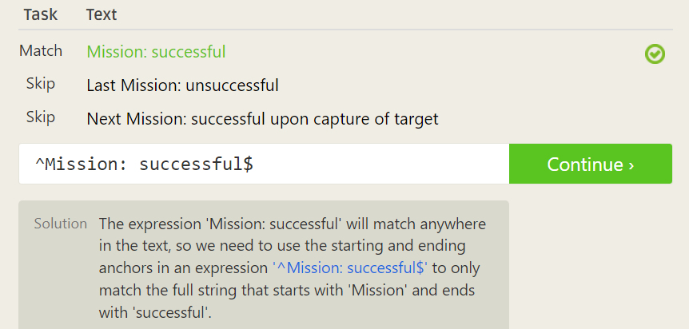

## Lesson 11: Match groups
To represent a group of characters, not just one single character, you can use the parentheses `()`.

With the previous lessons, you can use `()` along with `^` (start-with), `$` (end-with), and other special characters mentioned earlier to create more precise patterns.

### Exercise 11: Matching Groups
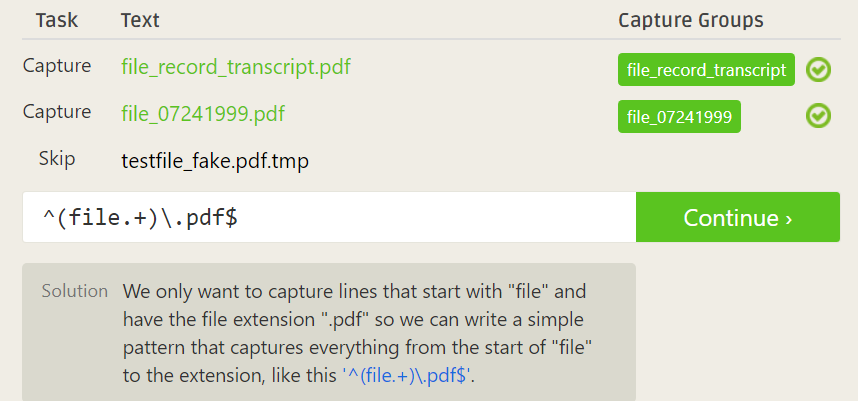

## Lesson 12: Nested Groups
You can use `()` inside a `()` to represent layers of patterns.

### Exercise 12: Matching Nested Groups
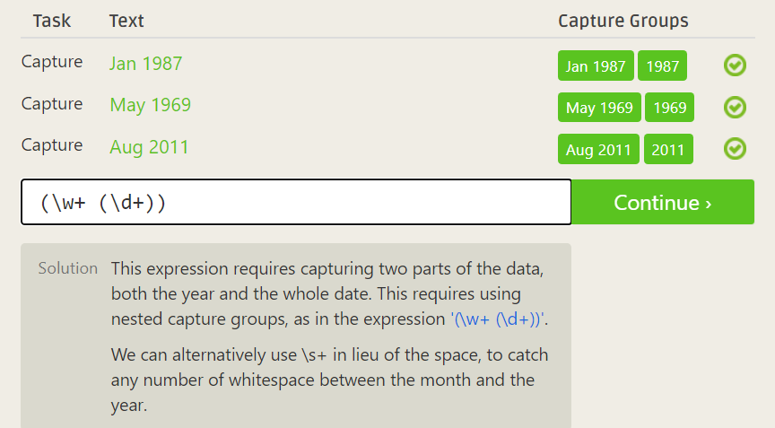

## Lesson 13: More Groupings
You can use quantifiers or the question mark not only on a single character, but also on a group.

For example, `(\d{3})?` means that a group of three digits is optional.

### Exercise 13: Matching Nested Groups
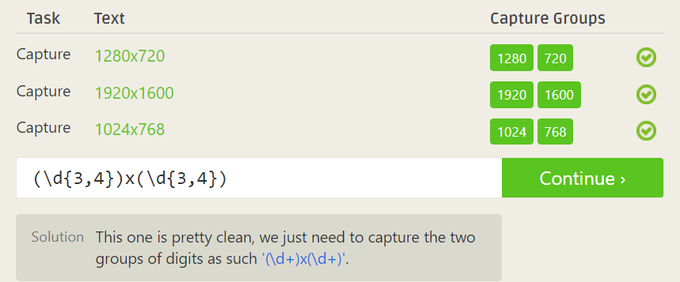

## Lesson 14: Logical OR
You can use `|`, the pipe character, to represent logical OR.

For example, `(milk|bread|juice)` means "milk", "bread", or "juice". You can also use logical OR on patterns, such as `([bc]ats?|[dh]ogs?)`.

### Exercise 14: Matching Conditional Text
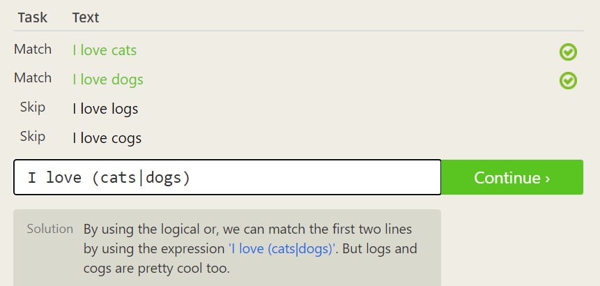
